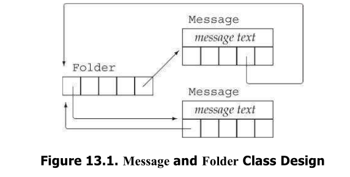

### 拷贝控制示例

#### 用例:
- 本程序的类需要拷贝控制来进行簿记操作，设计两个类，这两个类用于邮件处理应用中。
- 两个类的名称分别为: Message 和 Folder, 分别代表电子邮件消息和消息目录。
- 每个 Message 可以出现在多个 Folder 中
- 任意给定的 Message 的内容只有一个副本。这样如果一条 Message内容改变，我们在各个Folder中浏览时看到都改变了。

设计思路如图：

为了记录 Message 位于哪些 Folder 中， 每个 Message 都会保存一个它所在 Folder 的指针的 set, 同样的，每个 Folder 都保存一个它包含的 Message 的指针的 set. 
#### 类的设计
- Message 类提供 save 和 remove 操作来向一个给定Folder添加一条 Message 或是从中删除一条 Message. 为了创建一个新的Message，我们会指明消息内容，但不会指出Folder. 为了将一条 Message 放到一个特定 Folder 中，我们必须调用save. 
- 当我们拷贝一个 Message 时， 副本和原对象将是不同的 Message 对象， 但两个 Message 都出现在相同的 Folder 中。 因此，拷贝 Message 的操作包括消息内容和 Folder 的指针的 set 的拷贝。 而且我们必须在每个包含此消息的 Folder 中都添加一个指向新创建的 Message 的指针。 
- 当我们销毁一个 Message 时，它将不复存在。因此，我们必须从包含此消息的所有 Folder 中删除指向此 Message 的指针。 
- 当我们将一个 Message 对象赋予另一个 Message 对象时，左侧 Message 的内容会被右侧 Message 的内容替代。我们还必须更新 Folder 集合，从原来包含左侧 Message 的 Folder 中将它删除， 并将它添加到包含右侧 Message 的 Folder 中。 
	观察这些操作， 我们可以看到，析构函数和拷贝赋值运算符都必须从包含一条 Message 的所有 Folder 中删除它。 类似的，拷贝构造函数和拷贝赋值运算符都要将一个 Message 添加到给定的一组 Folder 中。 我们将定义两个 private 的工具函数来完成这些操作。 
**Best Practices: 拷贝赋值运算符通常执行拷贝构造函数和析构函数中也要做的工作。这种情况下，公共的工作应该放在 private 的工具函数中完成。** 

